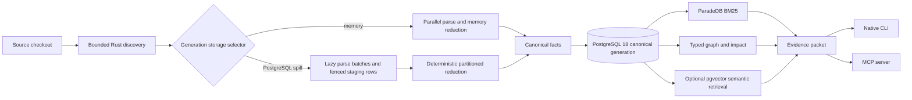

<div align="center">

# Cartograph

**Generation-safe code intelligence for AI coding agents.**

Native Rust CLI and MCP server · PostgreSQL 18 · code-aware BM25 · typed code graph

[](https://github.com/adder-factory/cartograph/releases/latest)
[](https://github.com/adder-factory/cartograph/actions/workflows/v2-rust.yml)
[](LICENSE)
[](https://www.rust-lang.org/)

**[Quick start](#quick-start)** · [Agent workflow](#agent-workflow) ·
[Languages](docs/SUPPORT-MATRIX.md) · [Architecture](#architecture) ·
[Documentation](docs/README.md) · [Changelog](docs/RELEASES.md)

</div>

---

Cartograph turns a source checkout into a searchable, immutable-generation code
graph. It gives coding agents compact evidence about declarations, references,
call flow, change impact, affected tests, and source freshness through one native
CLI and the [Model Context Protocol](https://modelcontextprotocol.io/).

The source checkout remains the source of truth. Every evidence packet carries
generation provenance, freshness, confidence, truncation, and explicit
abstention instead of presenting stale or incomplete data as certainty.

> [!IMPORTANT]
> Cartograph v2 is PostgreSQL-only. It requires PostgreSQL 18.4 or newer within
> major version 18, ParadeDB `pg_search` 0.26.0, and pgvector 0.8.4 or newer
> (0.8.7 recommended for external PostgreSQL).
> There is no SQLite runtime, compatibility mode, importer, optional feature,
> or fallback.

## Start here

| I want to… | Go to |
| --- | --- |
| Install Cartograph and build a first graph | [Quick start](#quick-start) |
| Hand setup to a coding agent | [Agent-assisted installation](docs/AGENT-INSTALL.md) |
| Connect Codex, Claude Code, Cursor, or another host | [MCP usage](docs/MCP-USAGE.md) |
| Look up a command, flag, or JSON field | [CLI reference](docs/CLI-REFERENCE.md) |
| Check a language, extension, or framework | [Language support matrix](docs/SUPPORT-MATRIX.md) |
| Operate, back up, or recover PostgreSQL | [Storage and operations](docs/STORAGE-BACKENDS.md) |
| Fix a failed setup, error code, or stale graph | [Troubleshooting](docs/TROUBLESHOOTING.md) |
| See what changed in each release | [Changelog](docs/RELEASES.md) |
| Browse every guide by task | [Documentation home](docs/README.md) |

## What Cartograph gives an agent

| Question | Evidence |
| --- | --- |
| Where is this declared or referenced? | Exact symbol, path, reference, and identifier lookup |
| Which code is most relevant? | Code-aware BM25 over names, implementation identifiers, and documentation |
| What calls this, and what does it call? | Typed callers, callees, imports, references, and shortest paths |
| What could this change affect? | Bounded reverse impact and structurally connected tests |
| Where is numerical behavior risky or statically unknown? | Generation-scoped Rust operation/hazard/precision sites with exact spans and explicit evidence limits |
| Is the graph current? | Immutable generation identity and exact supported-source freshness |
| What changed in the working tree? | Separately labeled live overlay and Git-ref review packets |
| Is an LLM required? | No for exact, lexical, graph, review, freshness, or affected-test workflows |

Cartograph also supports standard SCIP export, persistent per-file SCIP overlays,
model-scoped semantic retrieval, generated artifacts with explicit provenance,
and deterministic task-intent routing.

## Quick start

> [!TIP]
> Prefer agent-assisted setup? Give your coding agent the copy-paste task in
> [Agent-assisted installation](docs/AGENT-INSTALL.md).

### 1. Install the native executable

**macOS and Linux**

```sh
curl -fsSL https://raw.githubusercontent.com/adder-factory/cartograph/main/install.sh | sh
cartograph --version
```

**Windows PowerShell**

```powershell
irm https://raw.githubusercontent.com/adder-factory/cartograph/main/install.ps1 | iex
cartograph --version
```

The installers select the native archive for the host and verify it against the
release `SHA256SUMS`. `install.sh` links `cartograph` into `~/.local/bin` (or
`CARTOGRAPH_BIN_DIR`) and prints the `PATH` line to add if that directory is
missing; `install.ps1` adds its install directory to the user `PATH`.

### 2. Build the first graph

On macOS or Linux with a local Docker daemon:

```sh
cd /path/to/project
cartograph db start --project-path .    # project-owned, loopback-only PostgreSQL
cartograph doctor .                     # fails closed unless every capability passes
cartograph index .                      # publishes one complete generation
cartograph status .                     # must report that generation as fresh
cartograph context 'explain the primary request flow' --project-path .
```

On Windows, or to use your own server, see
[External PostgreSQL](#external-postgresql).

<details>
<summary>What <code>db start</code> and <code>doctor</code> check</summary>

`db start` creates project-owned, loopback-only resources and pulls the pinned
upstream ParadeDB 0.26.0 image, which contains `pg_search` 0.26.0 and
pgvector 0.8.6. `doctor` fails closed unless PostgreSQL, pg_search, pgvector, preload,
BM25, migrations, and code tokenization all pass.

`doctor --json` retains `ready` as the backward-compatible hard-capability
result and mirrors it as `capabilitiesReady`. Its separate `projectReadiness`
object reports database, index, freshness, deterministic retrieval, optional
semantic retrieval, on-disk registration, live MCP transport, and overall
onboarding states. Checks that `doctor` does not perform are `not_checked`,
never inferred from another successful layer; `nextActions` contains only
path-safe follow-up commands.

</details>

### 3. Connect a coding agent

Cartograph writes project-scoped MCP configuration and pins the absolute native
executable path. For Claude Code the project entry lives under
`projects.<path>.mcpServers` in `~/.claude.json`, Claude's local scope.

```sh
cartograph install --yes --target codex  --location local --project-path .  # OpenAI Codex
cartograph install --yes --target claude --location local --project-path .  # Claude Code
cartograph install --yes --target cursor --location local --project-path .  # Cursor
```

The installer supports 19 hosts in total; see the
[CLI reference](docs/CLI-REFERENCE.md#mcp-and-agent-configuration) for every
target ID.

<details>
<summary>Using a non-default database port</summary>

If the default managed database port is occupied, start the database with
`db start --port <PORT>`. A local install without `CARTOGRAPH_DATABASE_URL`
discovers the project-owned container's published port and writes that
non-secret loopback port into the portable `serve` arguments for the selected
host; pass `install --managed-database-port <PORT>` only to pin a port before
the container exists. Direct project commands discover an existing
project-owned container's published port when neither the flag nor
`CARTOGRAPH_MANAGED_DATABASE_PORT` is set; an explicit wrong port fails with
the discovered port instead of a generic connection error.

</details>

### 4. Verify the live integration

A setup is ready only after all four signals pass:

1. `cartograph doctor` proves database capabilities.
2. `cartograph index` publishes one complete generation.
3. `cartograph status` reports that generation as fresh.
4. A real `find` or `context` query returns generation-scoped evidence.

A CLI request proves the executable and database path. After restarting an
agent host, make one live MCP request as the separate transport-health check.
Until that happens, `doctor` deliberately reports `liveTransport` as
`not_checked`; an on-disk registration never proves which child process an
already-running host loaded.

### Upgrade

Versioned native installs register the stable
`~/.cartograph-cli/current/bin/cartograph` launcher. A normal version-to-version
upgrade is one resumable command from the project root:

```sh
cartograph upgrade --apply --project-path .
```

Require `completed: true` in the report, and reopen an agent host only when
`restartRequired` is true.

<details>
<summary>What the upgrade does and how to read its report</summary>

It verifies and smoke-tests the release, switches the stable launcher, applies
safe migrations, refreshes the current generation, runs `doctor`, proves a
next-process status from the installed binary, and repairs stale owned host
pins. Require `completed: true`; `projectReconciliation.state: source_changed`
is a completed upgrade whose checkout kept changing, so index again once edits
pause. If managed-database replacement is necessary, follow only
the exact backup and confirmation commands in the report, then rerun the same
upgrade command to resume. Reopen an agent host only when `restartRequired` is
true; an attached MCP child cannot hot-load a new binary.

See [Agent-assisted installation](docs/AGENT-INSTALL.md#upgrade-an-existing-installation)
for the complete recovery boundaries.

</details>

## Platform and database support

| Host | Native release | Managed local database | External PostgreSQL |
| --- | :---: | :---: | :---: |
| macOS 26 on Apple Silicon | ✅ | ✅ with local Docker | ✅ |
| Current 64-bit Linux, glibc 2.41+ (arm64 / x64) | ✅ | ✅ with local Docker | ✅ |
| Windows 11 25H2+ / Server 2025 x64 | ✅ | — not enabled | ✅ |

Only current 64-bit operating-system generations are release targets. Intel
macOS and every 32-bit architecture are unsupported. Linux release binaries
target Debian 13's glibc 2.41 baseline or newer. Every Linux archive is built
in a pinned Rust/Trixie container and executed in a separate pinned Debian 13
runtime container before publication.

### External PostgreSQL

For an external deployment, the database administrator installs PostgreSQL 18.4
or newer within major version 18, `pg_search` 0.26.0, and pgvector 0.8.4 or
newer, and creates pgvector before `pg_search`. Load the connection URL from the
shell or a secret manager rather than a committed file:

```sh
export CARTOGRAPH_DATABASE_SCHEMA='cartograph_project'
# CARTOGRAPH_DATABASE_URL must already be present in the environment.

cartograph doctor /absolute/path/to/project
cartograph index /absolute/path/to/project
cartograph status /absolute/path/to/project
```

> [!WARNING]
> Database URLs are secrets. Public errors, debug output, MCP responses,
> archives, and project records are required to omit credentials and absolute
> checkout paths. See [PostgreSQL storage and operations](docs/STORAGE-BACKENDS.md).

## Agent workflow

A reliable coding loop starts with freshness, narrows with structural evidence,
and closes with impact-aware verification:

```sh
cartograph status .                                              # 1. is the graph fresh?
cartograph context 'fix authentication token validation' --project-path .   # 2. task evidence
cartograph find 'validateToken' --by name --project-path .       # 3. exact anchor
cartograph graph <symbol-id> --direction impact --project-path . # 4. blast radius
cartograph affected --symbol-id <symbol-id> --project-path .     # 5. tests to run
cartograph review --ref main --project-path .                    # 6. review the diff
```

If status is stale, run `cartograph index .` or use the bounded MCP admin action.
Indexing unchanged source is a no-op; changed source publishes a complete new
generation atomically.

### Core MCP tools

| Tool | Purpose |
| --- | --- |
| `cartograph_status` | Current generation, counts, capability readiness, and freshness |
| `cartograph_find` | Exact name/path/reference lookup or code-aware BM25 |
| `cartograph_context` | Intent-aware evidence, graph context, and edit candidates |
| `cartograph_entry_points` | Routes, commands, MCP tools, exports, and API boundaries |
| `cartograph_graph` | Callers, callees, reverse impact, paths, and symbol similarity |
| `cartograph_affected` | Bounded affected-test selection |
| `cartograph_numerical` | Generation-scoped static numerical hazards, coverage, explanations, and non-executing probe plans |
| `cartograph_review` | Git-ref plus staged, unstaged, and untracked evidence |
| `cartograph_admin` | Explicit index, sync, embedding, and maintenance jobs |

MCP profiles are `coding`, `core`, `full`, `read-only`, and `review`. Profiles
are immutable authorization ceilings with deterministic tool lists; a narrower
profile cannot call hidden tools. Cartograph supports modern stateless MCP
`2026-07-28` plus the legacy `2024-11-05` initialize path. Modern hosts should
cache the stable complete catalog and dynamically place only task-relevant
schemas in the model context; the server does not mutate tools per connection.
See [MCP usage](docs/MCP-USAGE.md#modern-protocol-and-dynamic-tool-selection).

<details>
<summary>CLI surface — selected high-use forms</summary>

These are selected high-use forms, not the complete command inventory. Run
`cartograph --help` for the installed binary or see the
[CLI reference](docs/CLI-REFERENCE.md) for every top-level command.

```text
cartograph index [PROJECT]
cartograph status [PROJECT]
cartograph find <QUERY> --by auto|name|content|env|sql|build|path|reference|bm25|hybrid \
  [--format text|json]
cartograph context <TASK> [--exact-name NAME] [--exact-path PATH] [--exact-reference TEXT]
cartograph entry-points [--bucket public-exports] [--limit 20]
cartograph graph <SYMBOL_ID> --direction callers|callees|both|impact
cartograph graph <SYMBOL_ID> --direction path --to <TARGET_SYMBOL_ID>
cartograph graph <SYMBOL_ID> --direction similar --k 5 --min-score 0.3
cartograph affected [CHANGED_FILE ...] --max-nodes 40
cartograph affected --symbol-id <SYMBOL_ID> --max-nodes 40
cartograph review --ref <GIT_REF>
cartograph serve --mcp [--profile coding|core|full|read-only|review]
cartograph doctor [PROJECT]
cartograph db <COMMAND>
cartograph install --yes --target <HOST>
cartograph uninstall --target <HOST> [--location local]
```

Text output is optimized for concise human diagnostics. JSON is the stable
automation surface where exposed by command help.

</details>

## Large codebases and streaming indexing

No special command is required for a large first index. With the default
`generationStorage: "auto"`, Cartograph selects its PostgreSQL spill path at
64 Cargo manifests, 10,000 supported files, 64 MiB of indexed source, or when a
conservative 16x source-expansion estimate reaches `maxGenerationBytes`. A
dense smaller corpus can opt in explicitly through `.cartograph/config.json`:

```json
{
  "version": 2,
  "generationStorage": "postgres"
}
```

Readers continue to see the prior complete generation until the new canonical
generation passes validation and publishes. In the published
[VS Code streaming benchmark](docs/v2/benchmarks/LARGE-PUBLIC-CORPUS-STREAMING.md)
(14,693 files, about 171 MB of source, measured on the v2.1.11 pre-release
candidate), extraction took 23.04 seconds and the complete cold index 467.42
seconds at 2.90 GiB maximum RSS; an unchanged-source reconciliation took 3.19
seconds.

<details>
<summary>How the spill path stays bounded</summary>

The spill path lazily admits at most 64 files and 64 MiB of combined source per
parse work item, reuses one parser per encountered language, and writes
file-local extraction plus resolved typed facts in bounded batches. PostgreSQL
then performs deterministic partitioned reduction behind the staging
generation's lease and fence.

This bounds the bulky per-file working set; it does not make every native
structure unlimited. Compact project-wide resolution, clone, and centrality
indexes remain bounded by `maxGenerationBytes`, while `maxSpillBytes` and
`maxSpillRows` bound the durable unordered payload. Cartograph fails closed at
either boundary rather than lowering extraction or graph quality.

Parse time and complete-index time are separate measurements. The benchmark
records the final pre-release candidate retained with v2.1.11; it is not an
exact tagged-binary rerun. That candidate extracted 14,693 files / 171,015,058
source bytes in 23.04 seconds. The full cold request, including resolution,
reduction, exact digest, BM25 construction, and atomic publication, completed
in 467.42 seconds at 2.90 GiB maximum RSS. A qualified error such as
`resolve_progress_stalled` means the watchdog observed no durable work
checkpoint; it does not merely mean that a large stage ran for a long time.

</details>

See [configuration](docs/CONFIGURATION.md),
[performance tuning](docs/PERF-TUNING.md), and
[capacity troubleshooting](docs/TROUBLESHOOTING.md#native-generation-reaches-its-capacity-bound)
for the complete limits and operator guidance.

## Architecture


```mermaid
flowchart LR
    A[Source checkout] --> B[Bounded Rust discovery]
    B --> C{Generation storage selector}
    C -->|memory| D[Parallel parse and memory reduction]
    C -->|PostgreSQL spill| E[Lazy parse batches and fenced staging rows]
    E --> F[Deterministic partitioned reduction]
    D --> G[Canonical facts]
    F --> G
    G --> H[(PostgreSQL 18 canonical generation)]
    H --> I[ParadeDB BM25]
    H --> J[Typed graph and impact]
    H --> K[Optional pgvector semantic retrieval]
    I --> L[Evidence packet]
    J --> L
    K --> L
    L --> M[Native CLI]
    L --> N[MCP server]
```

| Boundary | Guarantee |
| --- | --- |
| **Native runtime** | Rust owns discovery, parsing, resolution, bounded parallel indexing, retrieval, CLI, and MCP. No Bun, Node.js, or TypeScript runtime is shipped. |
| **One durable store** | PostgreSQL 18 owns canonical project and generation state. ParadeDB BM25 and model-scoped HNSW are rebuildable derived indexes. |
| **Atomic publication** | Incomplete or unhealthy generations never become current. Readers query one verified immutable generation. Large builds can use generation-fenced PostgreSQL spill and deterministic partitioned reduction without exposing staging rows. |
| **Deterministic concurrency** | 1, 2, 4, 8, and 16-worker builds reduce to the same logical digest and ordered evidence. |
| **Optional generation** | Exact lookup, BM25, graph, review, freshness, and affected tests work without an LLM. Generative output cannot replace structural truth. |

For crate ownership, schemas, leases, retrieval, MCP boundaries, and failure
semantics, read the [v2 architecture](docs/v2/ARCHITECTURE.md).

## Language support

The stable registry production-admits **132 language modes**: all 73 v1.1.33
modes with the complete 163 v1 extension manifest, additive Python `.pyi` stubs,
and 59 new modes: TOML, WGSL, Metal, Slang, WESL, Ada/SPARK, VHDL, and 52
game-scripting languages. Sixty-seven modes use pinned native tree-sitter
grammars; 65 mixed-markup, configuration, domain-specific, and game-scripting
modes use bounded Rust structural scanners.

Every admitted mode must prove deterministic facts, cancellation, literal
safety, parallel-worker identity, and live PostgreSQL/ParadeDB publication.
Unknown extensions are excluded rather than represented as a misleading empty
graph. For each of the 73 v1 modes, a per-language
[v1 parity oracle](docs/LANGUAGE-COVERAGE-REPORT.md#v1-parity-oracle) checks
v2's extraction against the facts the real v1.1.33 binary extracted from the
same fixture corpus and fails on any fact that has neither a v2 counterpart nor
a pending or intentional ledger entry.

[Language support matrix](docs/SUPPORT-MATRIX.md) ·
[Game scripting coverage](docs/v2/GAME-SCRIPTING-LANGUAGES.md) ·
[Native extraction architecture](docs/v2/EXTRACTION.md) ·
[Add or extend a language](docs/EXTENDING-EXTRACTORS-RESOLVERS.md)

## Managed database operations

Common read-only or idempotent lifecycle commands:

```sh
cartograph db status --project-path .
cartograph db logs --project-path . --tail 200
cartograph db usage --project-path . --format json
cartograph db compact --project-path . --format json  # dry-run plan
cartograph db derived-index --project-path .
cartograph db backup ./cartograph.backup --project-path .
cartograph db stop --project-path .
```

> [!CAUTION]
> Restore, upgrade, derived-index rebuild, removal, import, and prune can replace
> or delete state. Each requires its exact confirmation phrase (listed in
> [Storage and operations](docs/STORAGE-BACKENDS.md#destructive-operations-and-confirmation-phrases))
> and is never implied by a diagnostic request.

<details>
<summary>Container limits, storage reporting, compaction, and housekeeping</summary>

New or confirmed-replacement managed containers have explicit 2 GiB memory,
four-CPU, and 256-process ceilings plus bounded PostgreSQL memory and worker
settings. A 15-minute checkpoint interval, 2 GiB soft `max_wal_size`, 256 MiB
`min_wal_size`, and `wal_compression=lz4` absorb rapid generation COPY/BM25
bursts without weakening synchronous durability. `db status` reports the observed Docker
limits and compatibility; an older owned container is never silently replaced
and uses the normal backup-gated, confirmed `db upgrade` path; `db status`
reports `postgres_settings: current | outdated | absent`.

Default `status` output includes compact database/schema/heap/index/TOAST
allocation in readable IEC units such as MiB and GiB. JSON and MCP retain the
exact `*Bytes` integers and add a `databaseStorage.humanReadable` projection for
display. `db usage` remains the detailed bounded report and separates schema
heap/index/TOAST, generation, and parse-cache allocations. Parse-cache evidence
distinguishes uncompressed logical payload, live compressed storage,
whole-schema allocation, and physical overhead so a high-water TOAST file cannot
masquerade as live cache data.

`db compact` plans bounded one-at-a-time concurrent B-tree rebuilds and remains
read-only until `--apply --confirm compact-online-indexes`; apply also requires
verified filesystem headroom. `db compact --heap` measures free-but-allocated
main and TOAST heaps; its offline apply requires `--confirm compact-heap-relations`,
no live project operations, and one `ACCESS EXCLUSIVE` `VACUUM FULL` rewrite at a
time.

Legacy inline LLM keys can be audited with
`cartograph llm migrate-credentials .` and atomically moved only after an exact
environment-value match. Local backend logs rotate at 32 MiB. The bounded
`cartograph backend cleanup .` dry run reports old rotated logs and invalid PID
state.

</details>

Community ParadeDB BM25 is treated as rebuildable local derived data. Shared,
hosted, replicated, customer-facing, or paying production use requires a
separate durability and ParadeDB licensing decision. See
[PostgreSQL storage and operations](docs/STORAGE-BACKENDS.md) for the full
lifecycle.

## Migrating from v1.1.33

V2 imports only from a v1.1.33 PostgreSQL schema. It never opens or inspects a
SQLite graph.

<details>
<summary>Import steps</summary>

If the only v1 index is SQLite, either rebuild v2 from the source checkout or
use the v1.1.33 binary to migrate SQLite to PostgreSQL first. The PostgreSQL v1
source and v2 destination must be distinct schemas in the same database.

Always back up the database, quiesce project writers, and run the non-mutating
preflight before the confirmed import:

```sh
cartograph db import-v1 \
  --project-path /absolute/path/to/current-project \
  --source-checkout /absolute/path/to/exact-v1-checkout \
  --source-schema cartograph_v1 \
  --dry-run \
  --format json
```

</details>

The full resumable workflow, validation rules, and retention constraints are in
[PostgreSQL storage and operations](docs/STORAGE-BACKENDS.md#import-from-v1133-postgresql).

## Security and release guarantees

- Inputs, rows, bytes, tasks, output, deadlines, and retries have hard caps.
- User query text is bound data; dynamic schema identifiers use validated
  quoting paths.
- Source reads stay within a canonical project root and reject unsupported,
  oversized, or non-UTF-8 input.
- Write operations use PostgreSQL-clock leases, fencing tokens, advisory locks,
  bounded transactions, and rollback on lost ownership.
- Release archives contain only the native executable, README, license, and
  allowlisted third-party notices.
- Every stable release requires strict Rust gates, live PostgreSQL fault tests,
  deterministic worker benchmarks, Sonar, independent review, four native
  archive audits, checksums, provenance, and a signed tag at published `main`.

Cartograph does not bundle PostgreSQL, ParadeDB, pgvector, an extension package,
or a container image. See the [distribution and licensing policy](docs/v2/LICENSING.md).

## Documentation

The [documentation home](docs/README.md) organizes every guide by task and
audience.

| Area | Guides |
| --- | --- |
| **Set up** | [Agent-assisted installation](docs/AGENT-INSTALL.md) · [Configuration](docs/CONFIGURATION.md) · [MCP usage](docs/MCP-USAGE.md) |
| **Use** | [CLI reference](docs/CLI-REFERENCE.md) · [CLI/MCP alignment](docs/cli-mcp-alignment.md) · [Language support matrix](docs/SUPPORT-MATRIX.md) · [Graph export formats](docs/GRAPH-EXPORT-FORMATS.md) |
| **Operate** | [Storage and operations](docs/STORAGE-BACKENDS.md) · [Performance tuning](docs/PERF-TUNING.md) · [Troubleshooting](docs/TROUBLESHOOTING.md) |
| **Extend** | [Architecture](docs/v2/ARCHITECTURE.md) · [Native extraction](docs/v2/EXTRACTION.md) · [Extending languages and resolvers](docs/EXTENDING-EXTRACTORS-RESOLVERS.md) |
| **Evidence** | [Changelog](docs/RELEASES.md) · [Verification and benchmarks](docs/v2/benchmarks/README.md) · [Distribution and licensing](docs/v2/LICENSING.md) |

## Development

The repository pins its Rust toolchain in `rust-toolchain.toml`.

```sh
git clone https://github.com/adder-factory/cartograph.git
cd cartograph
cargo build --locked --release -p cartograph-cli

cargo fmt --all --check
cargo clippy --locked --workspace --all-targets --all-features -- -D warnings
cargo test --locked --workspace
RUSTDOCFLAGS='-D warnings' cargo doc --locked --workspace --all-features --no-deps
cargo deny --all-features check
```

<details>
<summary>CI and release gates</summary>

The complete live PostgreSQL/ParadeDB gate is defined in
[`v2-rust.yml`](.github/workflows/v2-rust.yml). Documentation-only changes run a
focused documentation contract while the Windows, macOS, Linux release, live
PostgreSQL, and benchmark work stays skipped. Any source, dependency, workflow,
release-note, or mixed change fails closed to the complete gate. A manual
workflow dispatch also runs the complete gate.

A successful complete exact-SHA main run emits a GitHub-attested gate manifest;
the documentation-only path does not. Release tags verify that immutable
evidence instead of rerunning the live suite, then build and smoke macOS 26
arm64, current Linux arm64/x64, and current Windows x64 archives before
checksums, provenance, and immutable publication. Run the complete workflow
manually before releasing an exact main SHA that has only documentation-only
validation.

</details>

## License

Cartograph is licensed under the [MIT License](LICENSE). Third-party components
retain their own licenses; see [ACKNOWLEDGEMENTS.md](ACKNOWLEDGEMENTS.md) and the
[ParadeDB distribution boundary](docs/v2/LICENSING.md).
